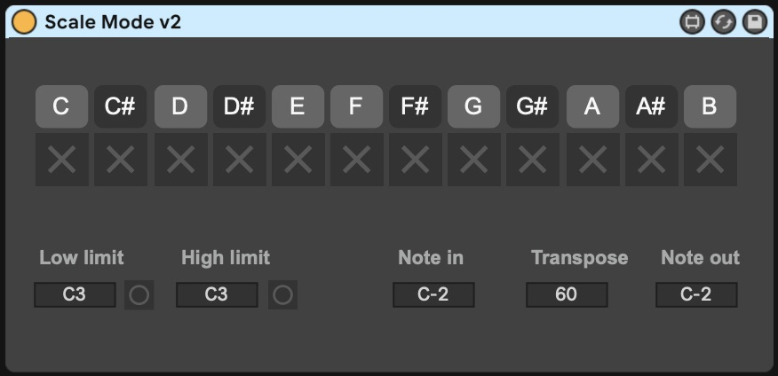
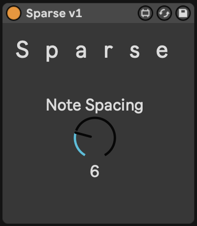

# max-midi
A collection of MIDI effects created in Max for Live

## Scale Mode

I created the Scale Mode devices to make it easier to use the MIDI Figter 3D as 
a melodic input device.

Scale mode takes a range of input notes and maps them to a continuous scale. It 
differs from the stock Scale MIDI effect becuase it doesn't repeat (or drop) any 
notes that are out of scale. This allows any standard button/pad controller that 
sends MIDI note messages to be used in a similar manner to the Ableton Push devices.

## Sparse

The Sparse MIDI device drops incomming notes if the interval to the nearest note is
less than the specified spacing. This allows for playing all the notes of a scale 
algorithmically/randomly, while avoiding any strong dissonance. 